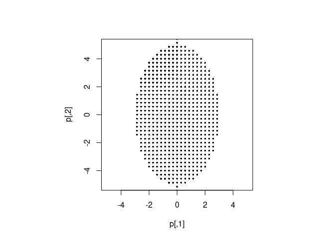
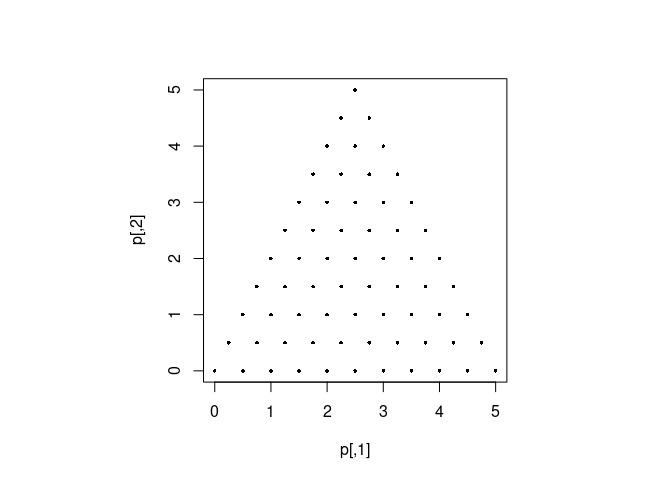

<!-- README.md is generated from README.Rmd. Please edit that file -->

# shapegrid

Creates a grid of points enclosed within a shape. Code taken from
<https://people.sc.fsu.edu/~jburkardt/cpp_src/>. Install package
dependencies:

``` r
pkgs = c("Rcpp", "remotes" )
install.packages(pkgs)
```

Then install `shapegrid` package from github:

``` r
remotes::install_github("daffp/shapegrid")
```

Run some examples to see that it is working.

An ellipse

``` r
library(shapegrid)
par(pty="s")
p = ellipse_grid(10, c(3,5), c(0,0))
plot(p, pch=16, cex=0.5, ylim=c(-5, 5), xlim=c(-5, 5))
```



A triangle

``` r
par(pty="s")
p = triangle_grid(10, c(0,0, 5,0, 2.5,5))
plot(p, pch=16, cex=0.5)
```


